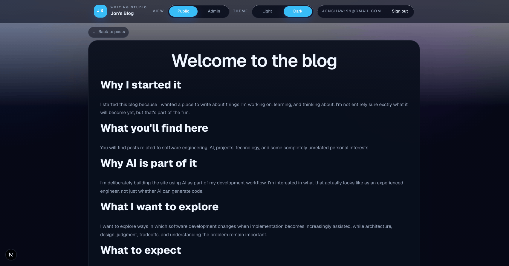
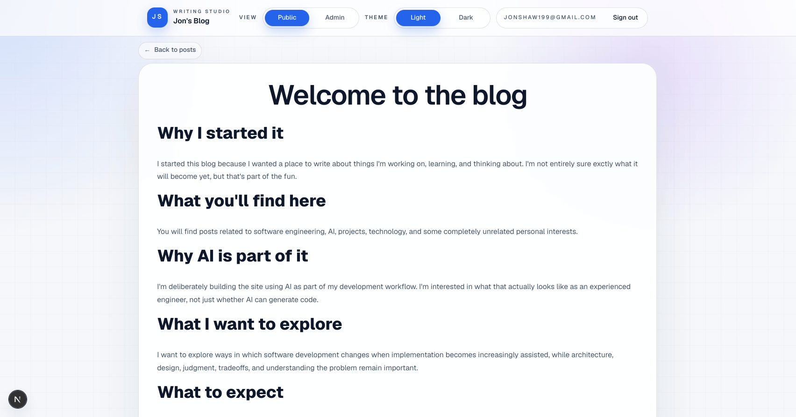
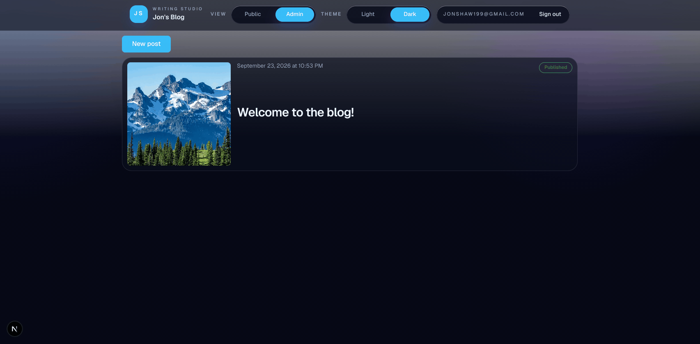

# Jon's Blog

A personal blog built with Next.js and Supabase, with a public reading experience and an authenticated admin workflow for writing, editing, theming, tagging, and media management.

Live blog: https://blog-tan-two-96.vercel.app/blog

## What It Does

- Public blog index and post pages
- Authenticated admin mode for creating and editing posts
- Rich text editor with image upload and library reuse
- Tag management and thumbnail selection
- Light and dark theme toggle across the app

## Admin Demo

Most visitors will only see the public blog. These screencasts show the authenticated admin features that are normally hidden from unauthenticated users.

### Light / Dark Mode



### Edit Existing Post



### Create New Post



## Stack

- Next.js App Router
- React
- TypeScript
- Tailwind CSS
- Supabase
- React Hook Form
- Quill

## Local Development

Run the development server:

```bash
pnpm dev
```

Then open [http://localhost:3000](http://localhost:3000).

## Scripts

```bash
pnpm dev
pnpm build
pnpm start
pnpm lint
```
